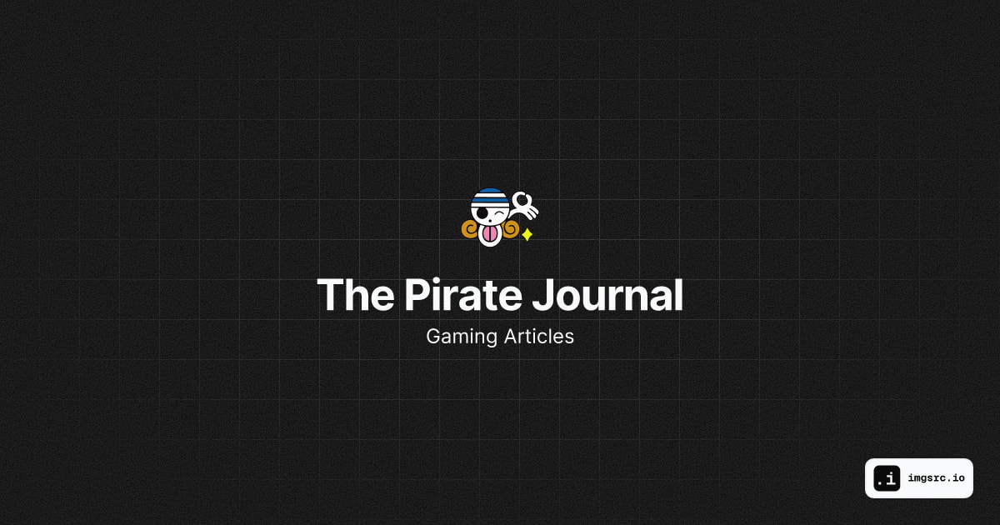

# The Pirate Journal

Игровой блог - ваш источник новостей и информации о последних игровых трендах, обзоры популярных игр и полезные советы для улучшения игрового опыта. Будьте в курсе всего, что происходит в мире игр!

## Файловая структура проекта

- next/ - папка с исходным кодом Next.js проекта
  - components/ - папка с компонентами проекта
  - pages/ - папка с отдельными страницами проекта
  - styles/ - папка с файлами стилей проекта
  - utils/ - папка с утилитарными функциями проекта
  - public/ - папка со статическими файлами проекта
  - next.config.js - конфигурационный файл Next.js
  - package.json - файл с зависимостями и скриптами проекта
- strapi/ - папка с исходным кодом Strapi проекта
  - api/ - папка с API моделями и контроллерами проекта
  - config/ - папка с конфигурацией проекта
  - plugins/ - папка с плагинами проекта
  - public/ - папка со статическими файлами проекта
  - strapi/ - папка с исполняемым файлом Strapi
  - package.json - файл с зависимостями и скриптами проекта
- nginx/ - папка с конфигурацией Nginx
  - default.conf - конфигурационный файл Nginx
- docker-compose.yml - файл с конфигурацией Docker Compose

## Зависимости

Основные зависимости проекта:

- Next.js
- Strapi
- Nginx
- Docker

## Лицензия

Licensed under the [MIT license](https://github.com/edssv/thepiratejournal/blob/main/LICENSE.md).
